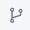

You can create a Git-enabled application by:

- Creating one application per repository, or
- Using a multi-module repository

You can flexibly create Git-enabled applications in any workspace, or you can create all Git-enabled applications in a single workspace to simplify management.

## Creating a Single Git-Enabled Application

To create a single Git-enabled application:

1. Navigate to the Applications page, click the **+** icon, and select **Create**.\
   The Choose Application Type modal appears.
2. Click **New Application** to start from scratch.\
   If you wish to import an existing application from a Git repository, click **Clone from Git**.\
   \
   For guidance on cloning applications from your Git account, see Cloning Applications from Git.&#x20;
3. Enter the **Name** and, optionally, click the **Use template** drop-down list to select the template you want to use to create it.
4. Since you're creating a Git-enabled application, the Application Type must be _Orchestration_, which is also the default value. Leave this field unchanged.
5. Enter a **Description** for your application.
6. Turn on the **Enable Git Control** switch.\
   Once you turn this switch on, new fields related to Git settings appear.
7. Enter the **Remote URL** to your Git repository.
8. Because you're creating a single Git-enabled application, leave the **Multi-Module Repository** check box deselected.
9. You now need to provide the credentials required to log into your Git repository.
   1. **Use existing credentials.**&#x20;
      1. Click **Use Existing Credentials** if you've already saved your Git credentials and want to reuse them.
      2. Click the **Credential Name** field and, from the drop-down list that appears, select the credential you want to use.\
         The associated Username appears automatically.\
         \
         For guidance on creating and maintaining credentials, see [managing-credentials.md](/docs/administering-koodisi/configuring-source-control-settings/managing-credentials). 
   2. **Use new credentials.**
      1. Click **New Credentials** to create a new set of Git credentials.
      2. Enter the **Credential Name**. This is the name that will be used to save the credential in the Credential Manager, which ties your user details with your account, making it unavailable for other users.
      3. Click and select the **Git Provider** where you've hosted your repository.
      4. &#x20;Enter the **Username** and **Personal Access Token** in the fields provided.
   3. **Continue without credentials**. Choose this option if you do not want to save your credentials in Koodisi. You will be asked to enter your credentials manually every time you run any Git command.
10. Click **Create**.

Your application is now created, and an additional Git icon  appears. Click this icon to view the Git side panel, which contains controls that enable you to manage the local and remote versions of your application data. For more information on using Git with applications, see [using-git-with-applications.md](/docs/using-git-to-develop-applications/using-git-with-applications).

## Creating a Multi-Module Application

When you first create an application in a multi-module repository, the repo is used as the default location for all multi-module applications within the workspace. See [single-vs.-multi-module-repositories.md](/docs/using-git-to-develop-applications/single-vs.-multi-module-repositories) to learn more about multi-module repositories.

To create an application within a multi-module repository:

1. Navigate to and expand the application node associated with your multi-modal repository. Click on the **Workflows** node.
2. Click the **Create** (+) icon. From the drop-down list that appears, select **Create**. \
   The Configure Your Application modal appears.
3. Provide details associated with your application as usual.
4. Turn on the **Enable Git Control** switch.\
   Git configuration options appear.
5. Enter the **Remote URL** of your application and select the **Multi-Module Repository** check box.
6. Provide your Git credentials and click **Create**.

You can now start working on the new application; the new application with all your updates will appear as an application under your multi-module repository.

:::info
&#x20;If you're creating a multi-module application, ensure that the name you provide for the application in Koodisi matches the application's name in the remote repository.
:::
