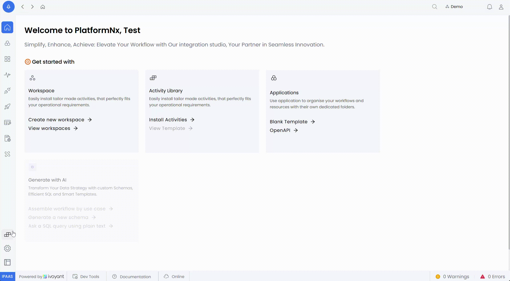
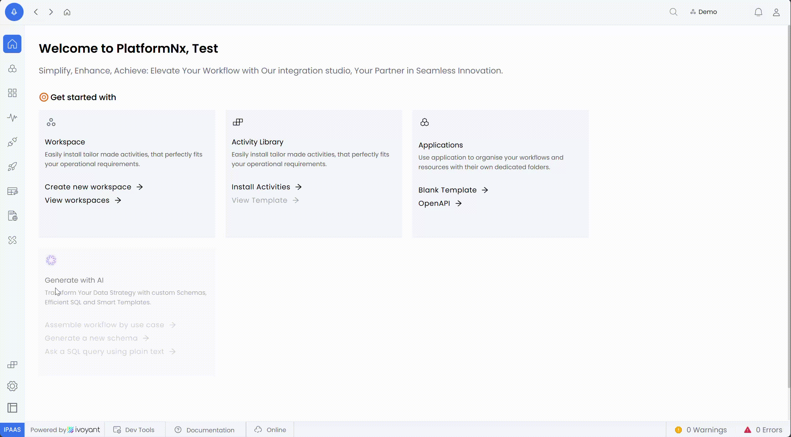
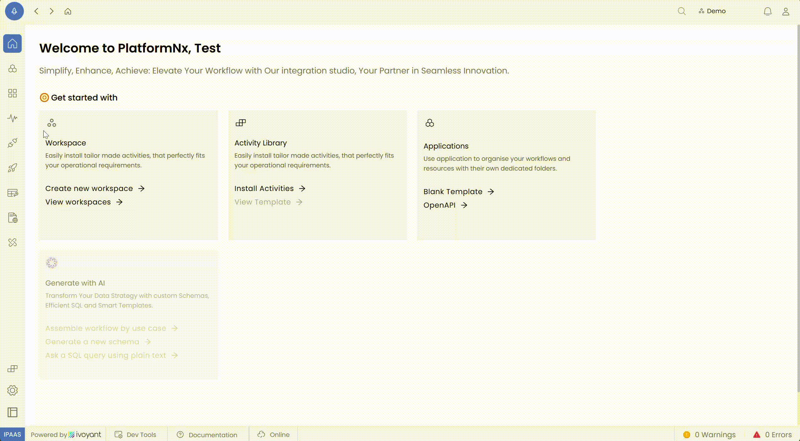

The **Library** is a centralized feature designed to manage and utilize reusable components, such as activities, templates, and configurations, in a structured manner. It allows users to create, install, and update custom activities, ensuring consistency and efficiency across workflows.

---

### **1. Accessing the Library**

- Open the **Library** option from the side menu of the platform.

### **2. Installing Activities**

- Navigate to the **Activities** section within the Library.
- Search for the desired activity using the search bar.
- Click the **Install** button next to the activity to add it to your environment.

### **3. Updating Activities**

- If an installed activity has a newer version available, the system will display an **Update** option.
- Click **Update** to replace the current version with the latest one.

### **4. Creating New Custom Activities**

- Click the **Create Activity** button in the Library.
- Provide the required details
  - **Name**: A unique identifier for the custom activity.
  - **Description**: Information about the activity's purpose.
  - **Configuration**: Define the activity's parameters and behavior.
- Save the activity to make it available for workflows.
