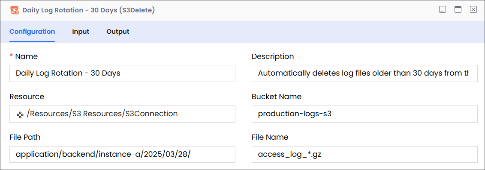

Description

Enables users to delete a specific file from an Amazon S3 bucket from within a workflow.

:::info

- Ensure that you have a properly configured Amazon Web Services (S3) connection resource set up under the Resources folder.
- S3 file names are case-sensitive; therefore, abc.JPG, abc.jpg, and ABC.jpg will be saved as different files. To ensure consistency, we recommend using lower-case file names and extensions: abc.jpg.
  :::

## Configuration

| Field       | Required | Description                                                                                                                                                                                                                                                                                                                     | Example                                                                                                                                                                                                                                                                                                                                |
| ----------- | -------- | ------------------------------------------------------------------------------------------------------------------------------------------------------------------------------------------------------------------------------------------------------------------------------------------------------------------------------- | -------------------------------------------------------------------------------------------------------------------------------------------------------------------------------------------------------------------------------------------------------------------------------------------------------------------------------------- |
| Name        | Required | The name of the activity. This name must be unique in a workflow.                                                                                                                                                                                                                                                               | Daily Log Rotation - 30 Days                                                                                                                                                                                                                                                                                                           |
| Description | Optional | The description of the activity. We recommend you make this as clear as possible to guide execution, foster understanding, and support collaboration.                                                                                                                                                                           | Automatically deletes log files older than 30 days from the production log bucket.                                                                                                                                                                                                                                                     |
| Resource    | Required | A predefined resource for accessing S3 files.                                                                                                                                                                                                                                                                                   | /Resources/S3 Resources/S3Connection                                                                                                                                                                                                                                                                                                   |
| Bucket Name | Required | The name of the S3 bucket where the activity will target files.                                                                                                                                                                                                                                                                 | production-logs-s3                                                                                                                                                                                                                                                                                                                     |
| File Path   | Required | 
The path within the specified S3 bucket that leads to the folder containing the file to be deleted.

<strong>Note</strong>

<em>While entering the path, only include the virtual directories without adding the bucket name, because the buck name is already specified (see Bucket Name, above).</em>
 | 
For example, consider the following complete path:

<code>production-logs-s3/instance-a/2025/03/28/</code>

In this complete path:
<ul><li><code>production-logs-s3</code> is the bucket that contains the file that you want to delete.</li><li><code>instance-a/2025/03/28</code> is the path to the file.</li></ul> |
| File Name   | Required | The name of the file(s) that you want to delete.                                                                                                                                                                                                                                                                                | access_log\_\*.gz                                                                                                                                                                                                                                                                                                                      |

## Input > Target

| Field    | Required | Data Type | Description                                                                                      | Example                                     |
| -------- | -------- | --------- | ------------------------------------------------------------------------------------------------ | ------------------------------------------- |
| filepath | Optional | String    | The path to the bucket (without the bucket name) that contains the file that you want to delete. | `application/backend/instance-a/2025/03/28` |
| filename | Optional | String    | The name of the file that you want to delete.                                                    | `access_log_*.gz`                           |

## Output

| Field       | Required | Data Type | Description                           | Example |
| ----------- | -------- | --------- | ------------------------------------- | ------- |
| JSON Schema | Optional | NA        | A custom schema that can be imported. | NA      |
