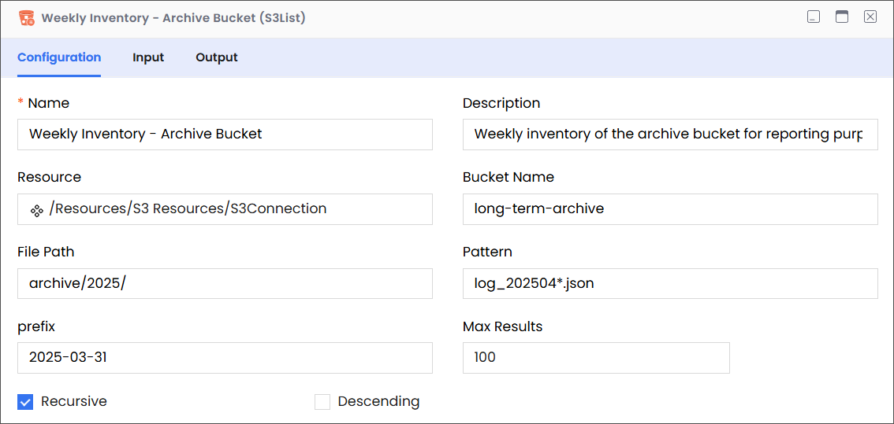

# S3List

Description

Enables you to list files in an Amazon S3 bucket.

:::info

- Ensure that you have a properly configured Amazon Web Services (S3) connection resource set up under the Resources folder.
- S3 file names are case-sensitive; therefore, abc.JPG, abc.jpg, and ABC.jpg will be saved as different files. To ensure consistency, we recommend using lower-case file names and extensions: abc.jpg.
  :::

## Configuration

| Field       | Required | Description                                                                                                                                                                                                                                                                                                                         | Example                                                                                                                                                                                                                                                                                                                 |
| ----------- | -------- | ----------------------------------------------------------------------------------------------------------------------------------------------------------------------------------------------------------------------------------------------------------------------------------------------------------------------------------- | ----------------------------------------------------------------------------------------------------------------------------------------------------------------------------------------------------------------------------------------------------------------------------------------------------------------------- |
| Name        | Required | The name of the activity. This name must be unique in a workflow.                                                                                                                                                                                                                                                                   | Weekly Inventory - Archive Bucket                                                                                                                                                                                                                                                                                       |
| Description | Optional | The description of the activity. We recommend you make this as clear as possible to guide execution, foster understanding, and support collaboration.                                                                                                                                                                               | Weekly inventory of the archive bucket for reporting purposes.                                                                                                                                                                                                                                                          |
| Resource    | Required | A predefined resource for accessing S3 buckets.                                                                                                                                                                                                                                                                                     | /Resources/S3 Resources/S3Connection                                                                                                                                                                                                                                                                                    |
| Bucket Name | Required | The name of the bucket that contains the files that you want to list.                                                                                                                                                                                                                                                               | long-term-archive                                                                                                                                                                                                                                                                                                       |
| File Path   | Required | 
The path within the specified S3 bucket that leads to the folder containing the files that you want to list.

<strong>Note</strong>

<em>While entering the file path, only list the virtual directories without adding the bucket name, because the it is already specified (see Bucket Name, above).</em>
 | 

For example, consider the following complete path:

<code>archive/2025/long-term-archive</code>

In this complete path:
<ul><li><code>long-term-archive</code> is the bucket that contains the files that you want to list.</li><li><code>archive/2025</code> is the path to the file.</li></ul> |
| Pattern     | Optional | An optional pattern (e.g., using wildcards like `*` or `?`) to further filter the listed files based on their names within the specified bucket and prefix. This allows targeting files with specific naming conventions.                                                                                                           | `log_202504*.json`                                                                                                                                                                                                                                                                                                      |
| Prefix      | Optional | Lists files whose names begin with the specified prefix.                                                                                                                                                                                                                                                                            | 2025-03-31                                                                                                                                                                                                                                                                                                              |
| Max Results | Optional | Specifies the maximum number of file listings to retrieve in a single request. This can be useful for managing large buckets and processing results in batches.                                                                                                                                                                     | 100                                                                                                                                                                                                                                                                                                                     |
| Recursive   | Optional | Instructs the application to retrieve matching files recursively from subdirectories.                                                                                                                                                                                                                                               | Deselected                                                                                                                                                                                                                                                                                                              |
| Descending  | Optional | Instructs the application to display results in alphabetically descending order.                                                                                                                                                                                                                                                    | Deselected                                                                                                                                                                                                                                                                                                              |

## Input

| Field      | Required | Data Type | Description                                                                                      | Example            |
| ---------- | -------- | --------- | ------------------------------------------------------------------------------------------------ | ------------------ |
| filepath   | Optional | String    | The path to the bucket (without the bucket name) that contains the file that you want to delete. | `archive/2025`     |
| pattern    | Optional | String    | The file pattern that you want to use to filter the list of files in the target bucket.          | `log_202504*.json` |
| prefix     | Optional | String    | The prefix that you want to use to identify files to be listed from the specified file path.     | `2025-03-31`       |
| maxResult  | Optional | Number    | The maximum number of search results that you want to be returned at a time.                     | `100`              |
| recursive  | Optional | Boolean   | Instructs the application to retrieve matching files recursively from subdirectories, if true.   | `FALSE`            |
| descending | Optional | Boolean   | Instructs the application to display results in alphabetically descending order, if true.        | `FALSE`            |

## Output

| Field                | Required | Data Type | Description                                                                                                               | Example                             |
| -------------------- | -------- | --------- | ------------------------------------------------------------------------------------------------------------------------- | ----------------------------------- |
| schema               | Required | NA        | A custom schema that can be imported.                                                                                     | NA                                  |
| files                | Required | Array     | The returned array containing the list of matching files in the destination bucket.                                       | NA                                  |
| files > path         | Required | String    | The path to the file.                                                                                                     | `archive/2025/long-term-archive`    |
| files > name         | Required | String    | The name of a file in the returned array. There must be at least one item in this list for the List call to be successful | raw/sensor-data/part-0001.json      |
| files > size         | Required | Number    | The size of the file (in bytes).                                                                                          | `2500`                              |
| files > createdTime  | Required | String    | The date-time when the file was created.                                                                                  | `2025-03-10T19:20:30+01:00`         |
| files > lastModified | Required | String    | The date-time when the file was last modified.                                                                            | `2025-03-15T09:10:30+01:00`         |
| files > permissions  | Required | String    | Permissions associated with the file.                                                                                     | Read, write, delete or manage files |
| files > properties   | Required | String    | Properties associated with the file.                                                                                      | `content-type`                      |
| files > directory    | Required | Boolean   | Indicates a child directory.                                                                                              | `True`                              |
| totalFiles           | Required | Number    | Indicates the number of files in the target bucket.                                                                       | `23`                                |
