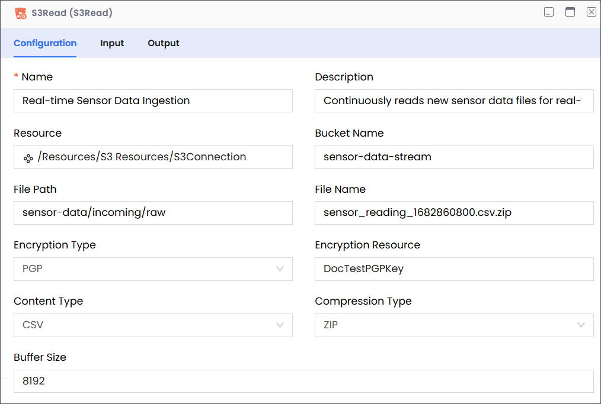

Description

Enables you to read a file in an Amazon S3 bucket.

:::info

- Ensure that you have a properly configured Amazon Web Services (S3) connection resource set up under the Resources folder.
- S3 file names are case-sensitive; therefore, abc.JPG, abc.jpg, and ABC.jpg will be saved as different files. To ensure consistency, we recommend using lower-case file names and extensions: abc.jpg.
  :::

## Configuration

| Field            | Required | Description                                                                                                                                                                                                                                                                                                             | Example                                                                                                                                                                                                                                                                                                                                           |
| ---------------- | -------- | ----------------------------------------------------------------------------------------------------------------------------------------------------------------------------------------------------------------------------------------------------------------------------------------------------------------------- | ------------------------------------------------------------------------------------------------------------------------------------------------------------------------------------------------------------------------------------------------------------------------------------------------------------------------------------------------- |
| Name             | Required | The name of the activity. This name must be unique in a workflow.                                                                                                                                                                                                                                                       | Real-time Sensor Data Ingestion                                                                                                                                                                                                                                                                                                                   |
| Description      | Optional | The description of the activity. We recommend you make this as clear as possible to guide execution, foster understanding, and support collaboration.                                                                                                                                                                   | Continuously reads new sensor data files for real-time analytics.                                                                                                                                                                                                                                                                                 |
| Resource         | Required | A predefined resource for accessing S3 buckets.                                                                                                                                                                                                                                                                         | /Resources/S3 Resources/S3Connection                                                                                                                                                                                                                                                                                                              |
| Bucket Name      | Required | The name of the bucket that contains the file that you want to read.                                                                                                                                                                                                                                                    | sensor-data-stream                                                                                                                                                                                                                                                                                                                                |
| File Path        | Required | 
The path within the specified S3 bucket that leads to the folder containing the file to be read.

<strong>Note</strong>

<em>While entering the file path, only list the virtual directories without adding the bucket name, because the it is already specified (see Bucket Name, above).</em>
 | 

For example, consider the following complete path:

<code>sensor-data/incoming/raw/sensor-data-stream</code>

In this complete path:
<ul><li><code>sensor-data-stream</code> is the bucket that contains the files that you want to list.</li><li><code>sensor-data/incoming/raw</code> is the path to the file.</li></ul> |
| File Name        | Required | 
The name of the file that you want to read.

<strong>Note:</strong> <em>This field is case-sensitive and must precisely match the file name in S3.</em>

sensor_reading_1682860800.csv.zip
                                                                                                      | sensor_reading_1682860800.csv.zip                                                                                                                                                                                                                                                                                                                 |
| Encryption Type  | Optional | The type of server-side encryption used when the file was stored in S3, if any. This is necessary to correctly decrypt the file during reading.                                                                                                                                                                         | PGP                                                                                                                                                                                                                                                                                                                                               |
| Content Type     | Optional | The expected MIME type of the file content. While S3 stores metadata, explicitly defining it here can be useful for the reading process to interpret the data correctly (e.g., for parsing).                                                                                                                            | CSV                                                                                                                                                                                                                                                                                                                                               |
| Compression Type | Optional | The type of compression applied to the file. This is necessary to decompress the file content after reading it from S3.                                                                                                                                                                                                 | ZIP                                                                                                                                                                                                                                                                                                                                               |
| Buffer Size      | Optional | The size of the buffer (in Bytes) to use when reading the file from S3. This can impact performance, especially for large files. A larger buffer might improve read speeds but consume more memory.                                                                                                                     | 8192                                                                                                                                                                                                                                                                                                                                              |

## Input

| Field      | Required | Data Type | Description                                                                                                                                                                                         | Example                             |
| ---------- | -------- | --------- | --------------------------------------------------------------------------------------------------------------------------------------------------------------------------------------------------- | ----------------------------------- |
| filepath   | Optional | String    | The path to the bucket (without the bucket name) that contains the file that you want to delete.                                                                                                    | `sensor-data/incoming/raw`          |
| fileName   | Optional | String    | 
The name of the file that you want to read.

<strong>Note:</strong> <em>This field is case-sensitive and must precisely match the file name in S3.</em>
                          | `sensor_reading_1682860800.csv.zip` |
| bufferSize | Optional | String    | The size of the buffer (in Bytes) to use when reading the file from S3. This can impact performance, especially for large files. A larger buffer might improve read speeds but consume more memory. | `8192`                              |
| streaming  | Optional | Boolean   | Indicates whether you want to read the data in the file as a continuous flow (stream) of bytes instead of loading the entire file into memory at once                                               | `true`                              |

## Output

| Field         | Required | Data Type | Description                                                                                      | Example                             |
| ------------- | -------- | --------- | ------------------------------------------------------------------------------------------------ | ----------------------------------- |
| schema        | Optional | NA        | A custom schema that can be imported.                                                            | NA                                  |
| content       | Required | String    | The content read from the file.                                                                  | NA                                  |
| contentLength | Required | Number    | The size of the file in Bytes.                                                                   | `10292`                             |
| fileName      | Required | String    | The name of the file that was read.                                                              | `sensor_reading_1682860800.csv.zip` |
| path          | Required | String    | The path to the bucket (without the bucket name) that contains the file that you want to delete. | `sensor-data/incoming/raw`          |
