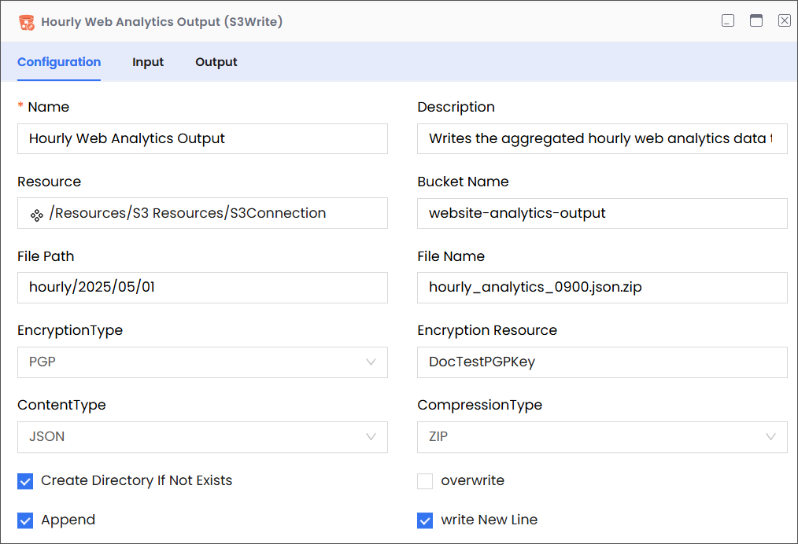

# S3Write

Description

Enables you to write content to a specific file in an Amazon S3 bucket.

:::info

- Ensure that you have a properly configured Amazon Web Services (S3) connection resource set up under the Resources folder.
- S3 file names are case-sensitive; therefore, abc.JPG, abc.jpg, and ABC.jpg will be saved as different files. To ensure consistency, we recommend using lower-case file names and extensions: abc.jpg.
  :::

## Configuration

| Field                          | Required | Description                                                                                                                                                                                                                                                                                                                                                                         | Example                                                                                                                                                                                                                                                                                                                                   |
| ------------------------------ | -------- | ----------------------------------------------------------------------------------------------------------------------------------------------------------------------------------------------------------------------------------------------------------------------------------------------------------------------------------------------------------------------------------- | ----------------------------------------------------------------------------------------------------------------------------------------------------------------------------------------------------------------------------------------------------------------------------------------------------------------------------------------- |
| Name                           | Required | The name of the activity. This name must be unique in a workflow.                                                                                                                                                                                                                                                                                                                   | Hourly Web Analytics Output                                                                                                                                                                                                                                                                                                               |
| Description                    | Optional | The description of the activity. We recommend you make this as clear as possible to guide execution, foster understanding, and support collaboration.                                                                                                                                                                                                                               | Writes the aggregated hourly web analytics data to S3.                                                                                                                                                                                                                                                                                    |
| Resource                       | Required | A predefined resource for accessing S3 buckets.                                                                                                                                                                                                                                                                                                                                     | /Resources/S3 Resources/S3Connection                                                                                                                                                                                                                                                                                                      |
| Bucket Name                    | Required | The name of the S3 bucket where the file will be written.                                                                                                                                                                                                                                                                                                                           | website-analytics-output                                                                                                                                                                                                                                                                                                                  |
| File Path                      | Required | 
The path within the specified S3 bucket where the file will be written. This can include a directory structure.

<strong>Note</strong>

<em>While entering the file path, only list the virtual directories without adding the bucket name, because the it is already specified (see Bucket Name, above).</em>
                                              | 

For example, consider the following complete path:

<code>web-analytics-output/hourly/2025/05/01/.</code>

In this complete path:
<ul><li><code>web-analytics-output</code> is the bucket that contains the files that you want to list.</li><li><code>hourly/2025/05/01</code> is the path to the file.</li></ul> |
| File Name                      | Required | 
The exact name of the file to be written, including its desired extension.

<strong>Note:</strong> <em>This field is case-sensitive and must precisely match the file name in S3.</em>

sensor_reading_1682860800.csv.zip
                                                                                                                                   | hourly_analytics_0900.json.zip                                                                                                                                                                                                                                                                                                            |
| Encryption Type                | Optional | Specifies the type of server-side encryption to apply when writing the file to S3.                                                                                                                                                                                                                                                                                                  | PGP                                                                                                                                                                                                                                                                                                                                       |
| Content Type                   | Optional | Specifies the MIME type of the content being written to the file. This helps S3 and downstream applications understand the file format.                                                                                                                                                                                                                                             | JSON                                                                                                                                                                                                                                                                                                                                      |
| Compression Type               | Optional | Specifies the type of compression to apply to the content before writing it to the file in S3.                                                                                                                                                                                                                                                                                      | ZIP                                                                                                                                                                                                                                                                                                                                       |
| Create Directory if Not Exists | Optional | Instructs the application to create the specified File Path (directories) in the S3 bucket if it does not already exist before writing the file. If unchecked (False), and if the path does not exist, the write operation might fail depending on the underlying S3 behavior and the writing method used.                                                                          | True                                                                                                                                                                                                                                                                                                                                      |
| Overwrite                      | Optional | 
If selected (True) and a file with the specified File Path and File Name already exists in the S3 bucket, the system will overwrite the existing file with the new content. 

If unchecked (False), and the file exists, the write operation might fail or behave in an undefined manner depending on the underlying S3 API and the writing method.
                     | False                                                                                                                                                                                                                                                                                                                                     |
| Append                         | Optional | If checked (True) and a file with the specified File Path and File Name already exists, the new content will be added to the end of the existing file. If unchecked (False), the behavior will depend on whether "Overwrite" is checked. This option is typically useful for logging or accumulating data over time within a single file.                                           | True                                                                                                                                                                                                                                                                                                                                      |
| Write New Line                 | Optional | 
This option is relevant when the "Append" option is checked or when writing plain text files. 

If checked (True), the system will automatically add a newline character (\n) to the end of the content being written. 

This ensures that subsequent appends start on a new line, making the file more readable, especially for log files or line-delimited data.
 | True                                                                                                                                                                                                                                                                                                                                      |

## Input

| Field           | Required | Data Type | Description                                                                                                                                                                     | Example                          |
| --------------- | -------- | --------- | ------------------------------------------------------------------------------------------------------------------------------------------------------------------------------- | -------------------------------- |
| filepath        | Optional | String    | The path to the bucket (without the bucket name) that contains the file to which you want to write.                                                                             | `hourly/2025/05/01`              |
| fileName        | Optional | String    | 
The name of the file to which you want to write.

<strong>Note:</strong> <em>This field is case-sensitive and must precisely match the file name in S3.</em>
 | `hourly_analytics_0900.json.zip` |
| createDirectory | Optional | Boolean   | Instructs the application to create the file path in destination bucket if it doesn't exist.                                                                                    | `true`                           |
| content         | Optional | String    | The content that you want written into the destination file.                                                                                                                    | NA                               |

## Output

| Field         | Required | Data Type | Description                                                                                      | Example                          |
| ------------- | -------- | --------- | ------------------------------------------------------------------------------------------------ | -------------------------------- |
| schema        | Optional | NA        | A custom schema that can be imported.                                                            | NA                               |
| contentLength | Required | Number    | The size of the written file, in Bytes.                                                          | `10292`                          |
| fileName      | Required | String    | The name of the file to which you have written.                                                  | `hourly_analytics_0900.json.zip` |
| path          | Required | String    | The path to the bucket (without the bucket name) that contains the file to which you've written. | `hourly/2025/05/01`              |
