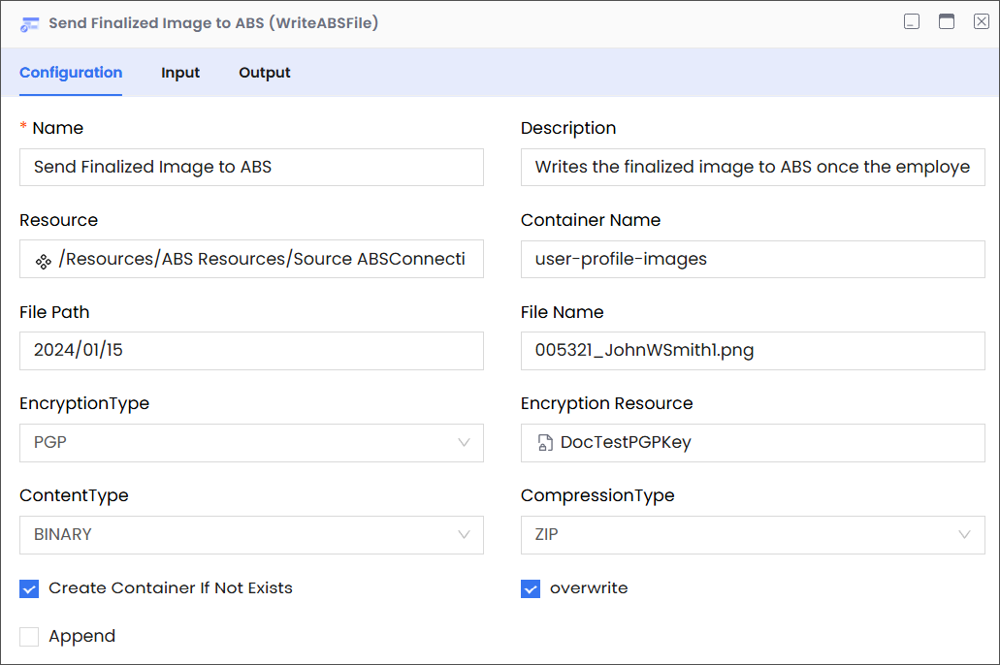
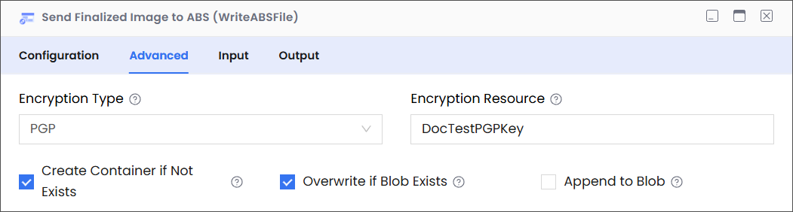

Description

Enables you to write data to any of the three types of Azure Blob Storage (ABS) blobs—block blobs, append blobs, and page blobs—in a container.

:::info

- Ensure that you have a properly configured SFTP connection resource set up under the Resources folder.
- SFTP file names are typically case-sensitive; therefore, abc.JPG, abc.jpg, and ABC.jpg will be saved as different files. To ensure consistency, we recommend using lower-case file names and extensions: abc.jpg.
  :::

## Configuring the WriteABSFile Activity

The WriteABSFile Configuration panel has four tabs: Configuration, Advanced, Input, and Output. This section offers details on how to use them.

### Configuration

| Field                          | Required | Description                                                                                                                                                                                                                                                                                                              | Example                                                                                                                                                                                                                                                                                                                                                                |
| ------------------------------ | -------- | ------------------------------------------------------------------------------------------------------------------------------------------------------------------------------------------------------------------------------------------------------------------------------------------------------------------------ | ---------------------------------------------------------------------------------------------------------------------------------------------------------------------------------------------------------------------------------------------------------------------------------------------------------------------------------------------------------------------- |
| Name                           | Required | The name of the activity. This name must be unique in a workflow.                                                                                                                                                                                                                                                        | Send Finalized Image to ABS                                                                                                                                                                                                                                                                                                                                            |
| Description                    | Optional | The description of the activity. We recommend you make this as clear as possible to guide execution, foster understanding, and support collaboration.                                                                                                                                                                    | Writes the finalized image to ABS once the employee finalizes and saves their profile picture in the HRMS.                                                                                                                                                                                                                                                             |
| Resource                       | Required | A predefined resource for accessing ABS blobs.                                                                                                                                                                                                                                                                           | /Resources/ABSConnection                                                                                                                                                                                                                                                                                                                                               |
| Container Name                 | Required | The name of the container in ABS.                                                                                                                                                                                                                                                                                        | user-profile-images                                                                                                                                                                                                                                                                                                                                                    |
| File Path                      | Required | 
The location of the virtual directory that contains the blob to which you want to write.

<strong>Note</strong>

<em>While entering the path, only include the virtual directories without adding the container name, because the container name is already specified (see Container Name, above).</em>
 | 
For example, consider the following complete path:

<code>user-profile-images/2024/01/15</code>

In this complete path:
<ul><li><code>user-profile-images</code> is the blob container.</li><li><code>15</code> is the virtual directory that contains the blob you want to update.</li><li><code>2024/01/15</code> is the path to the blob.</li></ul> |
| File Name                      | Required | The name of the blob file.                                                                                                                                                                                                                                                                                               | 005321_JohnWSmith1.png                                                                                                                                                                                                                                                                                                                                                 |
| Encryption Type                | Optional | The type of encryption that you want Azure to use when it stores the blob file.                                                                                                                                                                                                                                          | PGP                                                                                                                                                                                                                                                                                                                                                                    |
| Encryption Resource            | Optional | The resource that you want to use for encryption.                                                                                                                                                                                                                                                                        | DocTestPGPKey                                                                                                                                                                                                                                                                                                                                                          |
| Content Type                   | Optional | The content type of the file you want to write.                                                                                                                                                                                                                                                                          | BINARY                                                                                                                                                                                                                                                                                                                                                                 |
| Compression Type               | Optional | If you want to use compression, specify the format that you want to use.                                                                                                                                                                                                                                                 | ZIP                                                                                                                                                                                                                                                                                                                                                                    |
| Create container if Not Exists | Optional | 
Instructs the application to create a container with the specified name if it doesn’t exist.

<strong>Note</strong>

<em>Your account must have the access required to create a container.</em>
                                                                                                         | Deselected                                                                                                                                                                                                                                                                                                                                                             |
| Overwrite                      | Optional | Instructs the application to overwrite the existing file.                                                                                                                                                                                                                                                                | Deselected                                                                                                                                                                                                                                                                                                                                                             |
| Append                         | Optional | Instructs the application to append the blob content to the blob file already present in ABS.                                                                                                                                                                                                                            | Deselected                                                                                                                                                                                                                                                                                                                                                             |

### Advanced

| Field                          | Required                          | Description                                                                                                                                                                                    | Example           |
| ------------------------------ | --------------------------------- | ---------------------------------------------------------------------------------------------------------------------------------------------------------------------------------------------- | ----------------- |
| Encryption Type                | Optional                          | 
Specifies the encryption method for the file being written. Options are:- 
<ul><li><strong>None</strong>: No encryption.</li><li><strong>PGP</strong>: Encrypt using a PGP key</li></ul> | PGP               |
| Encryption Resource            | Required if Encryption Type = PGP | Select the PGP public key resource used to encrypt the file before upload.                                                                                                                     | SalesPGPPublicKey |
| Create Container if Not Exists | Optional                          | If selected, the Azure container will be created automatically if it does not already exist.                                                                                                   | Selected          |
| Overwrite if Blob Exists       | Optional                          | If selected, overwrites the blob if one with the same name already exists.                                                                                                                     | Deselected        |
| Append to Blob                 | Optional                          | If selected, appends the file content to an existing blob rather than overwriting it.                                                                                                          | Deselected        |

### Input

| Field           | Required  | Data Type | Description                                                                                                                                                                                                      | Example               |
| --------------- | --------- | --------- | ---------------------------------------------------------------------------------------------------------------------------------------------------------------------------------------------------------------- | --------------------- |
| blobpath        | Mandatory | String    | The location of the virtual directory (without the container name) that contains the blob to which you want to write.                                                                                            | `files/user-uploads`  |
| blobName        | Mandatory | String    | The name of the blob to which you want to write.                                                                                                                                                                 | `report_20240417.pdf` |
| createContainer | Optional  | Boolean   | 
Instructs the application to create a container with the specified name if it doesn’t exist.

<strong>Note</strong>

<em>Your account must have the access required to create a container.</em>
 | `True`                |

### Output

| Field         | Required | Data Type | Description                                                                                                                                                                                        | Example                               |
| ------------- | -------- | --------- | -------------------------------------------------------------------------------------------------------------------------------------------------------------------------------------------------- | ------------------------------------- |
| schema        | Required | NA        | A JSON schema describing the structure of the data written to the blob (if applicable). This is especially useful if the content being written is structured data that can be represented as JSON. | NA                                    |
| contentLength | Required | Number    | The size of the written blob in bytes. This corresponds to the `Content-Length` of the created blob in Azure Blob Storage.                                                                         | `125890` (representing 125,890 bytes) |
| fileName      | Required | String    | The final name of the blob created in Azure Blob Storage.                                                                                                                                          | `report_20240417.pdf`                 |
| path          | Required | String    | The location of the virtual directory (without the container name) that contains the blobs to which the application wrote.                                                                         | `files/user-uploads`                  |
