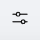

# Creating and Managing Definitions

## What are definitions?

Definitions allow you to define common schema structures once and then reference them throughout your schemas, avoiding redundancy and simplifying maintenance.

### Example of Definitions

Imagine you're designing schemas for various entities in an e-commerce system, and several of these entities (like `Customer`, `Order`, and `Vendor`) need to include an `Address`. Instead of defining the `Address` schema repeatedly within each entity's schema, you can define it once in the `definitions` section.

Here's how the `Address` schema might look as a separate JSON object within the `definitions` section of a larger schema:

JSON

```
{
   "type": "object",
   "properties": {
     "street": { "type": "string" },
     "city": { "type": "string" },
     "zipCode": { "type": "string" },
     "country": { "type": "string" }
     },
   "required": ["street", "city", "zipCode", "country"]
   }
```

Now, within your `Customer` schema, you can simply reference this `Address` definition using the `$ref` keyword:

JSON

```
{
  "type": "object",
  "properties": {
    "customerId": { "type": "integer" },
    "name": { "type": "string" },
    "shippingAddress": { "$ref": "#/definitions/Address" }
    // ... other customer properties
  }
```

## Creating Definitions

To create a schema definition:

1. Open a schema in Edit mode and click the **Definitions** .png>) icon.\
   The Definitions pane appears.
2. Click the **+** icon at the top of the Definitions pane and enter a name for the definition you want to create.&#x20;
3. Click the definition to edit its details.\
   The Schema Editor appears.
4. You can now directly create the schema using the Code View, or you can construct the schema using the Editor controls provided. See [#editing-schema-details-using-the-editor](editing-schemas.md#editing-schema-details-using-the-editor "mention") for more information.
5. Click **Save**.

You can now include the schema definition in other schemas to expand their scope and reuse definitions without altering their original structure.

## Editing Definitions

To edit a schema definition:

1. Open a schema in Edit mode and click the **Definitions** .png>) icon.\
   The Definitions pane appears.
2. Click the definition you want to edit to view its details in the Schema Editor.
3. You can now directly create the schema using the Code View, or you can construct the schema using the Editor controls provided. See [#editing-schema-details-using-the-editor](editing-schemas.md#editing-schema-details-using-the-editor "mention") for more information.
4. Click **Save**.

## Adding Definitions to a Schema

Syntactically, a definition is just another property of a schema. Therefore, to add a definition to a schema:

1. Open the schema in Edit mode and click the **Definitions** .png>) icon to display the Definitions panel.
2. Click the **Add** button in the Schema Editor to add the definition as a new property. To update an existing property in the schema, select it and click the **Properties**  icon in the toolbar associated with the property.
3. In the modal that appears, click the **Reference** tab.
4. Enter the **Name** of the definition in the schema.
5. Click and drag to the **Reference** field the definition that you want to associate with the schema property. The field is now updated to display the reference in the following syntax: `#/$defs/<definition_name>`. \
   \
   Ex: `#/$defs/Address`.
6. Add other details as appropriate and click **Apply**.
