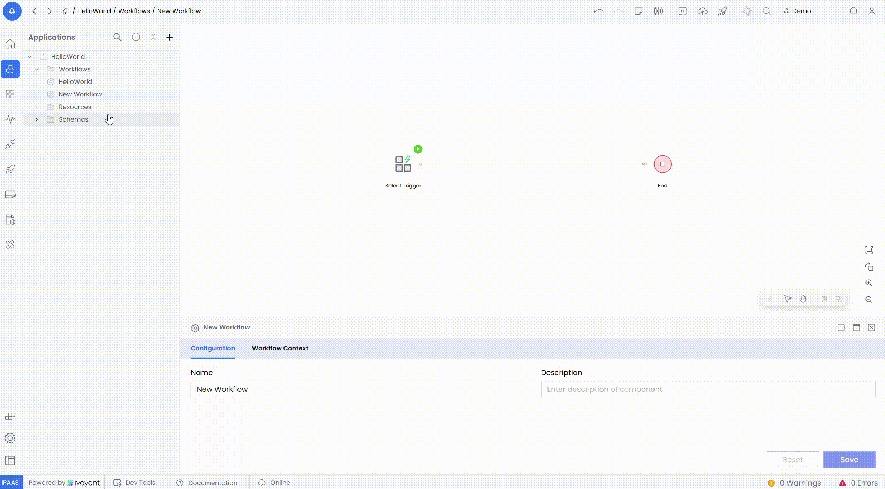
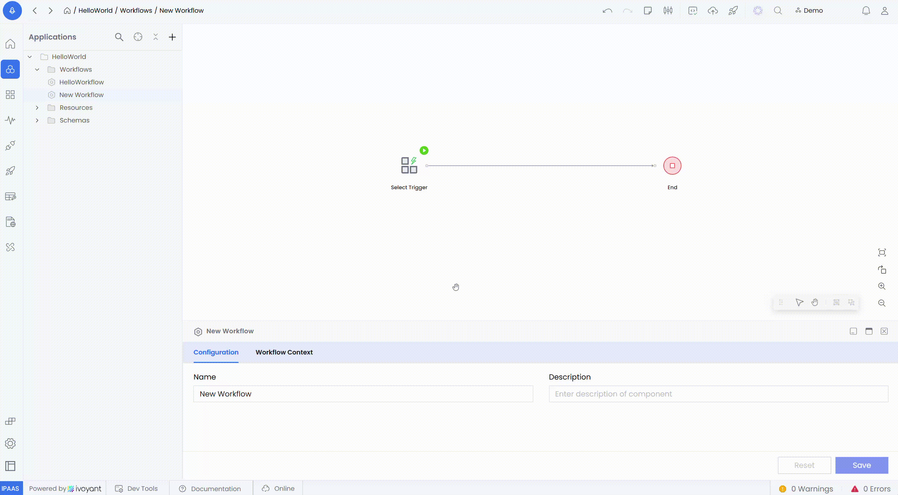

### **1. Create a Workflow**

If you’re new to creating workflows, refer to the [**Build Your First Workflow**](../../building-your-first-workflow/#steps-to-create-your-first-hello-world-workflow) guide for a detailed walkthrough on setting up workflows from scratch.

## Update

Pending.

### **2. Rename a Workflow**

Renaming a workflow updates its name across the platform, ensuring consistency across integrations and references.

**Steps**

1. Right-click on the workflow in the list and select **Rename**.
2. Enter the new name and click **Save** to confirm.

**Note:** Renaming automatically updates the workflow’s name wherever it is referenced. This does not impact functionality but improves clarity and organization.

### **3. Delete a Workflow**

Deleting a workflow permanently removes it from the platform along with all its activities and configurations.

**Steps**

1. Right-click on the workflow and select **Delete**.
2. Confirm the action in the popup dialog.

**Note:** This action is irreversible. Ensure the workflow is no longer needed, or export it before deleting to avoid data loss.

