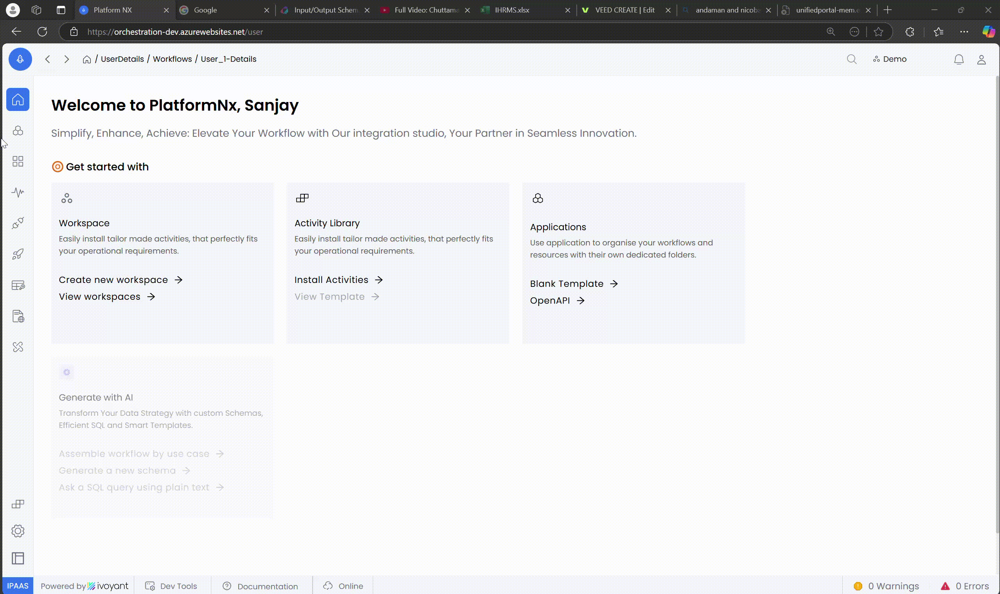
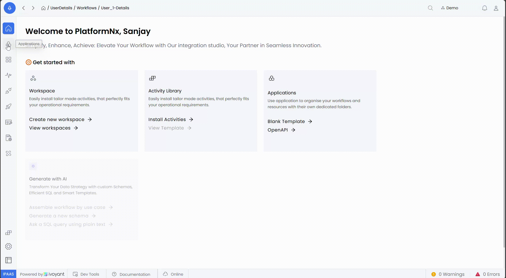
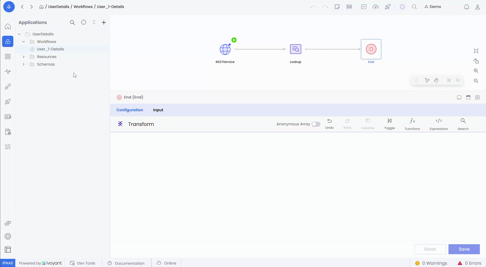
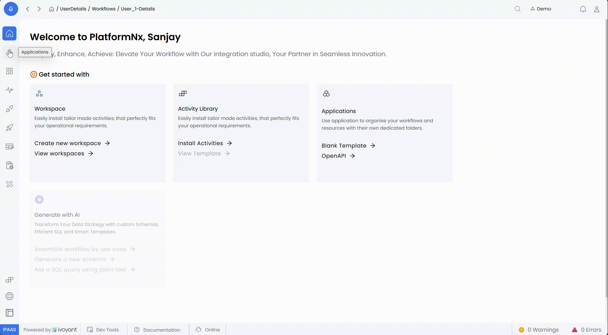
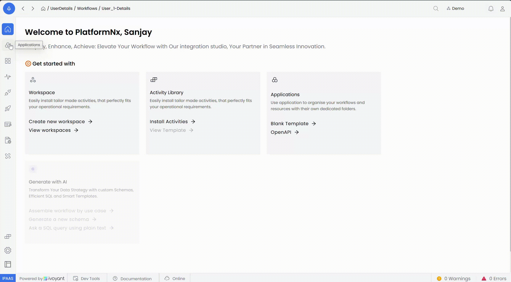
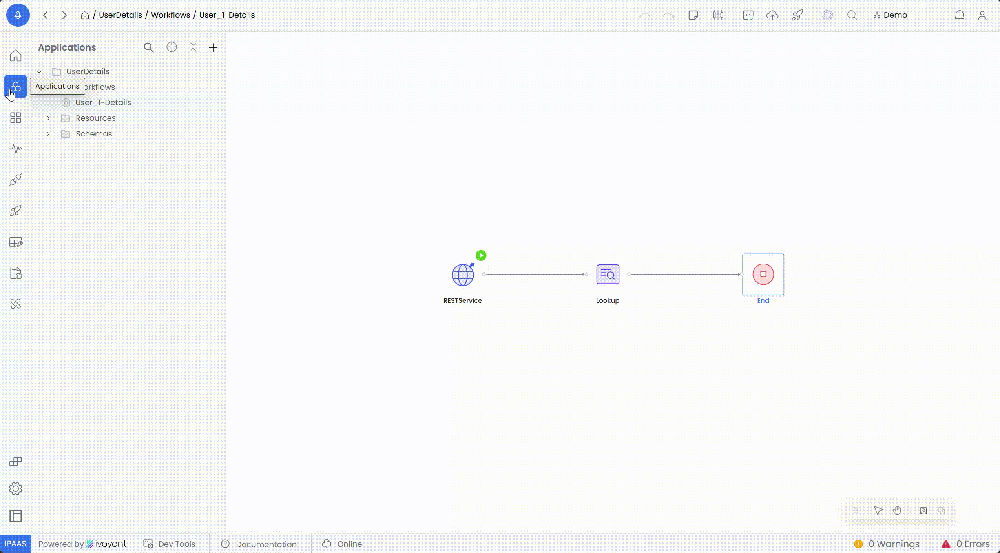
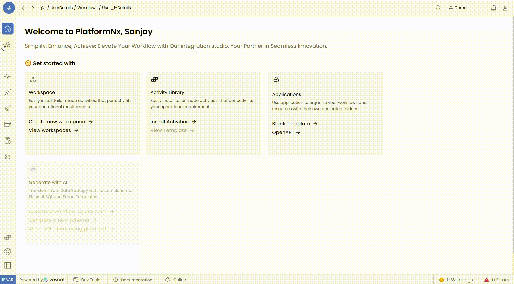

# Setting up Activity Mapping

Mapping facilitates the seamless transfer of data from a **source** (e.g., activity output, REST service) to a **target** (e.g., activity input, response schema). It ensures accurate and efficient data flow between components.

---

### **1. Key Components**

**Mapping Availability**

- **Mapping is available in every activity’s input configuration tab.**\
  This ensures that users can define how data flows into an activity during workflow execution.



**Source and Target**

- **Source:** The origin of the data, such as an activity output or an external system.
- **Target:** The destination for the data, typically defined in the activity’s input configuration or schema.



**Schema Extension**

- If an activity has a default schema, users can extend the schema in the target configuration.
  - **Steps**
    1. In the target area of the activity, click the **three dots** (kebab menu).
    2. Select the **Extend** option to add additional fields or modify the schema as per requirements.


**Drag-and-Drop Mapping**

- Users can map fields by dragging a source field and dropping it onto the corresponding target field, simplifying the mapping process.



---

### **2. Validation**

**Validation Button**

- After completing the mapping, click the **Validate** button to ensure correctness.
- **Validation checks**
  - All required fields are mapped.
  - Schema compatibility between the source and target.
  - Correct syntax in mapping expressions.

**Error Handling**

- If validation fails, errors are displayed in the **Mapping Error Panel**, highlighting
  - Missing mappings for required fields.
  - Schema mismatches or conflicts.
  - Invalid syntax in expressions.



---

### **3. Toggle Views**

The mapping interface includes **three toggle views** to help users manage mappings effectively

- **Default View**
  - Displays all fields, both mapped and unmapped.



- **Mapped View**
  - Shows only the fields that have been successfully mapped.



- **Unmapped View**
  - Highlights unmapped fields, allowing users to focus on completing their mappings.



---

### **4. Simplified Mapping Expressions**

**Overview**

Mapping expressions allow dynamic data handling by referencing fields and applying transformations directly in the mapping interface.

**Syntax**

- Reference structure

  ```
  ActivityName.FieldName
  ```

  - **ActivityName:** The source activity generating the data.
  - **FieldName:** The specific field being referenced.

**Examples**

1.  **Direct Mapping**

    ```
    ActivityName.FieldName
    ```

    Maps a specific field from the source activity.

2.  **Transformation**

    ```
    ActivityName.Value.toUpperCase()
    ```

    Converts the `Value` field to uppercase before mapping.

3.  **Conditional Mapping**

    ```
    ActivityName.Discount ? ActivityName.Discount : 0
    ```

    Provides a default value (`0`) if `Discount` is null.


---

### **5. Best Practices**

- **Leverage Mapping in All Activities:** Always configure input mappings for each activity using the input configuration tab.
- **Extend Schemas When Necessary:** Use the **Extend** option in the target schema to accommodate additional fields as needed.
- **Use Toggle Views:** Regularly check mapped and unmapped views to ensure all required fields are covered.
- **Validate Frequently:** Click the **Validate** button often to identify and resolve errors early.
- **Document Key Mappings:** Record any complex expressions or mappings for future reference.
