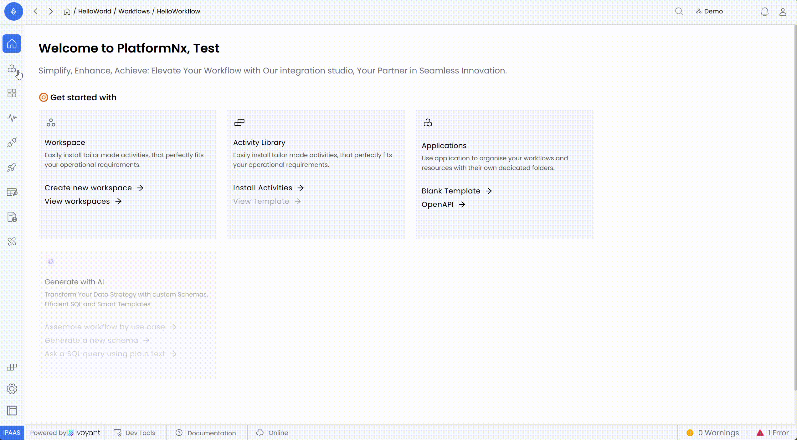
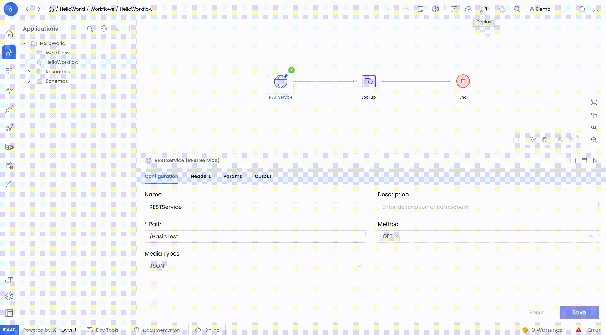
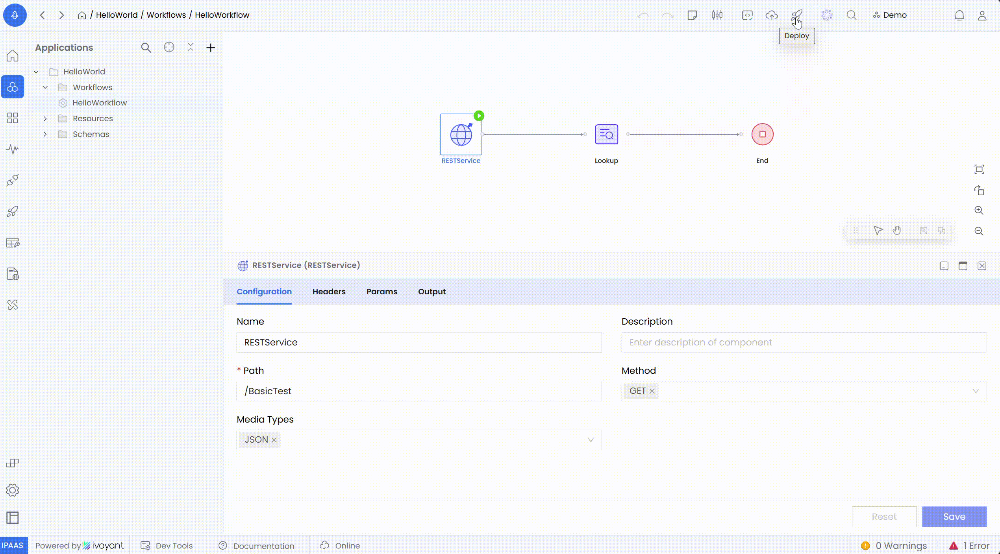
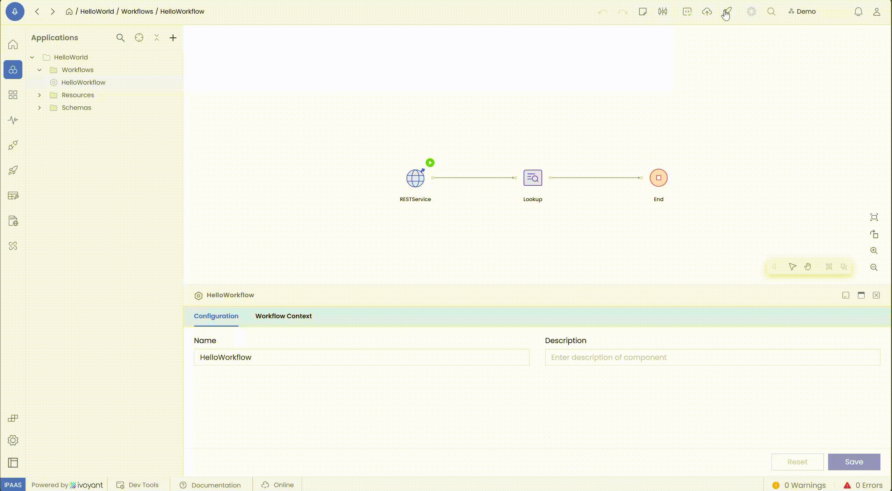

The **Test** feature enables users to

- Validate the functionality of deployed and promoted workflow versions.
- Test workflows in both **Secured API** and **Public API** modes.
- Customize headers, parameters, and request bodies to simulate real-world scenarios.

---

### **1. Accessing the Test Feature**

1. **Navigate to the Deployment/Promoted Workflow**
   - Go to the **Deploy Page**, which lists deployed and promoted workflow versions.
2. **Select the Workflow Version**
   - Identify the workflow to test and click the **Test** button next to it.



---

### **2. Steps to Test a Workflow**

**Step 1: Generate an Authentication Token**

- For **Secured API** workflows
  1. Click the **Refresh Token** button in the **Test Panel**.
  2. A new authentication token is generated and applied automatically for secure testing.



- For **Public API** workflows
  - Authentication is not required. Proceed directly to defining the request details.



**Step 2: Define Request Details**

1. **Headers**
   - Specify necessary HTTP headers, such as
     - `Content-Type: application/json`
     - `Authorization: Bearer <token>` (for secured APIs).
2. **Parameters**
   - Add query parameters as key-value pairs, for example
     - `?id=12345&status=active`
3. **Body**
   - Define the request body in the appropriate format (e.g., JSON).
   - Example

     ```json
     {
       "userId": "12345",
       "action": "activate"
     }
     ```



**Step 3: Execute the Test**

- Click the Send button to send the request to the selected workflow version.

.gif)

**Step 4: Analyze the Results**

- The tool provides
  - **Response Body:** View the returned data from the workflow.
  - **HTTP Status Code:** Check the response status (e.g., `200 OK`, `401 Unauthorized`).
