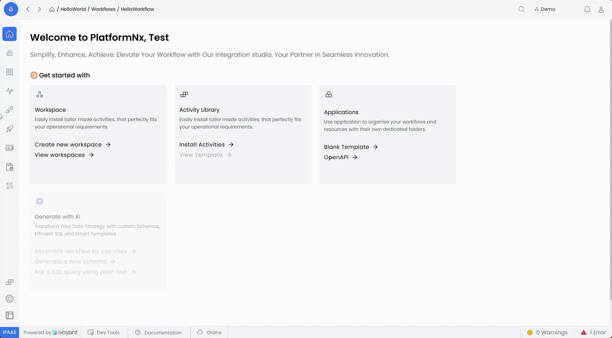

Lookup Tables can be dynamically used in workflows by directly dragging and dropping in Lookup Config screen. Here's how

The Primary Key's used in the table will be displayed in the input of the Lookup screen, this Primary Keys can be used for Mapping.

